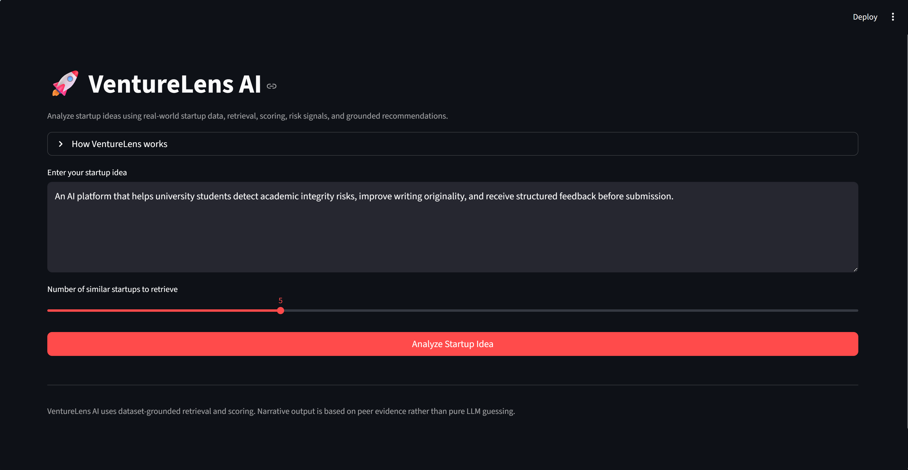

# 🚀 VentureLens AI

> An AI-powered system that analyzes startup ideas using **real-world startup data**, not just LLM intuition.

---
## Demo


## 🔥 Overview

VentureLens is a data-driven startup analysis tool that evaluates business ideas by:

- retrieving similar startups from a real dataset  
- computing evidence-based signals  
- scoring viability and risk  
- generating structured future scenarios  
- producing grounded recommendations  

Unlike typical AI tools, VentureLens **does not rely on LLM guessing** — it is built around a **Retrieval-Augmented Generation (RAG)** pipeline with real startup data.

---

## 🧠 System Architecture
User Idea
↓
Similarity Retrieval (TF-IDF)
↓
RAG Context Builder
↓
Scoring Engine (data-driven)
↓
Risk Analyzer
↓
Scenario Simulator
↓
Recommendation Engine
↓
Report Generator
↓
Streamlit UI


---

## ⚙️ Key Features

### 🔍 Retrieval-Augmented Analysis
- Finds similar startups from dataset  
- Uses similarity scores to ground reasoning  

### 📊 Data-Driven Scoring
- Peer success score  
- Similarity confidence  
- Evidence quality  
- Risk penalty calibration  

### ⚠️ Risk Analysis
- Detects weak market patterns  
- Identifies failure signals from peers  

### 🔮 Future Scenario Simulation
Each scenario includes:
- description  
- why it could happen  
- key trigger  
- warning signs  
- strategic actions  

### 📈 Radar Visualization
Multi-dimensional startup evaluation:

- Viability  
- Retrieval Strength  
- Peer Quality  
- Evidence Depth  
- Risk Control  

---

## 📁 Dataset

The system uses a processed startup dataset containing:

- description  
- industry / sub-industry  
- funding (total_funding_usd)  
- success_score  
- outcome_label  

This enables **evidence-based reasoning instead of hallucination**.

---

## 🚀 How to Run

```bash
git clone https://github.com/yourusername/venturelens-ai
cd venturelens-ai

pip install -r requirements.txt

streamlit run app.py

## 🧪 Example Use Cases

- Validate startup ideas before building

- Practice product thinking for interviews

- Analyze why similar startups succeeded or failed

- Explore market patterns in different industries

## 🧠 Design Philosophy

- “Don’t let the model guess — force it to reason from data.”

- VentureLens separates:

  Data layer → similarity + signals

  Logic layer → scoring + risk rules

  Narrative layer → explanation

  This makes the system:

  more interpretable

  more realistic

  more useful for learning


## 📌 Future Improvements

- Replace TF-IDF with embedding-based retrieval

- Add industry baseline scoring

- Improve calibration using percentile ranking

- Integrate real-time startup APIs

- Add memory & history tracking


## 💡 Why This Project Matters

- Most AI startup evaluators are just chatbots.

- VentureLens is different:

- grounded in real data

- modular architecture

- explainable outputs

- This makes it closer to a real decision-support system than a demo app.

## 👨‍💻 Author

- Built as a hands-on AI systems project

- Focus: turning AI from “text generator” → “reasoning system”